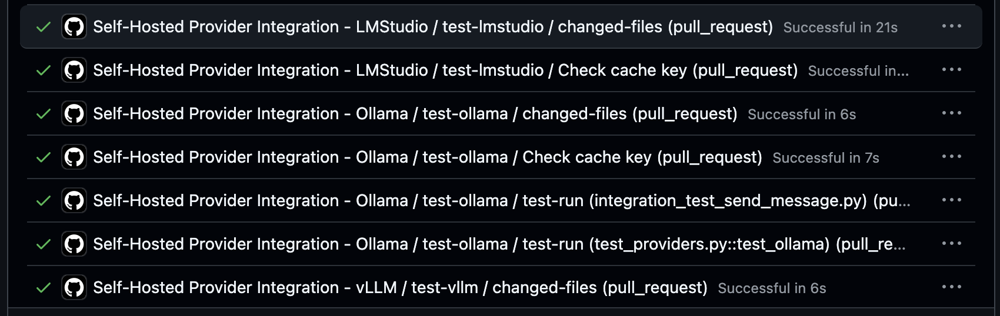

# Guide to Operating Self-Hosted LLM Providers in CI Pipelines

At Letta, there are a ton of interesting and novel challenges to solve. One such challenge is the slew of LLM inference providers a modern, pluggable framework must accommodate, not to mention their level of adherence to published standards \*cough\* OpenAI Chat Completions \*cough\*. With many models across many providers, it can be easy to accidentally break a provider integration or drop support for a particular model.

The conventional software engineering solution to this problem is to do integration testing, or to add "CI checks", in today's DevOps vernacular.

In Letta's CI, we do routine and extensive testing to ensure we do not drop support for any of our **hosted** inference providers in what we call our *model-sweep* ™️ (Blog post on that coming soon 👀) whose results are currently [published here](https://docs.letta.com/connecting-model-providers/supported-models).

But what about *self-hosted* inference providers?

These are much trickier. Not only are they more varied and bespoke, but they also pose a new challenge over the standard hosted providers: Freedom to choose whatever model you want! 

The freedom to choose is a great benefit and compelling argument for bootstrapping self-hosted providers, but when it comes to building CI jobs which involve LLMs, you need to add as much determinism as possible. **Trust me.** Some of the non-deterministic challenges we've had to face are beyond just asserting the model returns certain text, or that said text is in a particular format or schema. Letta as a framework abstracts a ton of complex functionalities from the upstream models, for example, tool calling. A smaller/faster/cheaper model, or even a huge one which is heavily quantized, may choose to call the wrong tool, or maybe not call one at all!

Challenges like this make software testing harder the closer you get to the model, but Letta is open-source + self-hostable, and we value our OSS community highly. It's important we ship high-quality software, so let's add self-hosted provider testing to CI!

First things first, what is the scope of the project? Although we'd love to support every possible provider of LLM inference, let's be realistic. In this case, we will limit our CI testing to the 3 largest self-hosted providers:
- [LM Studio](https://lmstudio.ai/) (or to use with [Letta](https://docs.letta.com/guides/server/providers/ollama))
- [Ollama](https://ollama.com/) (or to use with [Letta](https://docs.letta.com/guides/server/providers/lmstudio))
- [vLLM](https://docs.vllm.ai/en/latest/) (or to use with [Letta](https://docs.letta.com/guides/server/providers/vllm))

If you are unacquainted with these providers, here's a quick overview: LM Studio is a user-friendly desktop app with a beautiful UI, Ollama is a collection of CLI tools with a  model registry, and vLLM is the hyperscaler-preferred inference engine optimized for high-throughput and low-latency serving of transformer models.

If you'd prefer an analogy, I like to think of LM Studio as a Mac, Ollama as Docker, and vLLM as Linux. Hopefully you'll understand why by the end of this post.

## Our Self-hosted CI Runners

So let's talk a bit about our design choices. To minimize the burden of setup (we are a startup after all 😉) we are going to run each provider as a GCP VM configured as a self-hosted Github Actions runner. This allows us to easily integrate it into CI (leveraging existing self-hosted runners I might make a follow up post about), as well as mitigate the need to expose any endpoints unnecessarily beyond the machine running the test, i.e. keeping the provider accessible over localhost only.

So here's our setup:
 

And here's how our tests will be defined at the top-level: 
```
runner: '["self-hosted", "gpu", "ollama"]'
  matrix-strategy: |
    {
      "fail-fast": false,
      "matrix": {
        "test_suite": [
          "test_providers.py::test_ollama",
          "integration_test_send_message.py"
        ]
      }
    }
```

## LM Studio - Sleek and Configurable 
When I started writing this post, I had a lot of trouble running LM Studio in CI because it was only runnable as a full desktop application, which required a display server in the background, attaching the app to said display server, etc. which as you may imagine wasn't robust enough for the tumultuous world of best-effort, ephemeral CI runners, subject to autoscaling and public cloud GPU contention. Thankfully the team at LM Studio was able to get me a preview release of their [new docker container](https://hub.docker.com/r/lmstudio/llmster-preview)!

Here's what I worked out for our LM Studio Setup:

```
#!/bin/bash
set -e

echo "Setting up LMStudio..."

LLM_DIR="/opt/llm-providers"
sudo mkdir -p $LLM_DIR/lmstudio
sudo chown -R ${RUNNER_USER:-ci-runner}:${RUNNER_USER:-ci-runner} $LLM_DIR

# Create models directory for persistent storage
sudo mkdir -p $LLM_DIR/lmstudio/models
sudo chown -R ${RUNNER_USER:-ci-runner}:${RUNNER_USER:-ci-runner} $LLM_DIR/lmstudio/models

# Pull LMStudio Docker image and pre-download model
echo "Pulling LMStudio Docker image..."
sudo docker pull lmstudio/llmster-preview:cpu

echo "Setting up LMStudio Docker Compose configuration..."
sudo tee $LLM_DIR/lmstudio/docker-compose.yml > /dev/null << EOF
version: '3.8'
services:
  lmstudio:
    image: lmstudio/llmster-preview:cpu
    ports:
      - "1234:1234"
    volumes:
      - $LLM_DIR/lmstudio/models:/root/.lmstudio
    restart: unless-stopped
EOF

# Create startup script that starts container and loads model
sudo tee $LLM_DIR/lmstudio/start-lmstudio.sh > /dev/null << 'EOF'
#!/bin/bash
cd /opt/llm-providers/lmstudio
docker compose up -d
sleep 30  # Wait for container to be ready (15 seconds wasn't long enough)
docker exec lmstudio-lmstudio-1 lms get qwen2.5-7@Q4_K_M --yes
docker exec lmstudio-lmstudio-1 lms load qwen2.5-7b-instruct-1m
EOF

sudo chmod +x $LLM_DIR/lmstudio/start-lmstudio.sh

# Create systemd service for LMStudio
sudo cat << EOF | sudo tee /etc/systemd/system/lmstudio.service
[Unit]
Description=LMStudio Self-hosted Provider
After=docker.service
Requires=docker.service

[Service]
Type=oneshot
User=${RUNNER_USER:-ci-runner}
WorkingDirectory=$LLM_DIR/lmstudio
ExecStart=$LLM_DIR/lmstudio/start-lmstudio.sh
RemainAfterExit=yes

[Install]
WantedBy=multi-user.target
EOF

sudo systemctl start lmstudio.service
sudo systemctl enable lmstudio.service

echo "LMStudio setup complete!"
```

Some of the feedback I gave the LM Studio team was around making their LMS container more ergonomic for the automations for which it's built. I==n this case, the `lms load` command has to run before chat completions requests can start being served, which means we should codify all these prerequisite commands into a script called by the systemd unit since even if it was called at startup, if the service fails after startup we would similarly have to load the model upon service restart.== Can't wait to see what the LM Studio team cooks up once their container is officially released!

## Ollama - Simply Works

Ollama looks similar, but with more constrained model choice (has to be listed on Ollama registry, unlike vLLM and LM Studio which support pulling from hugging face) and the extremely convenient JIT model loading which loads the model into VRAM at inference time, and expires it once a TTL is reached. This is super convenient, because as long as the model is downloaded, as I was going back and forth trying different models, I could just naively query chat completions endpoint and expect the response from the requested model! 

The gift and curse of Ollama is their registry. It allows you easily pull models like docker containers, like `ollama pull qwen3:32b`, trying to determine the appropriate size/quantization of model to pull. On the flip side, you are limited only to which are in the Ollama registry, and furthermore I didn't see a way to download a specific quantization if you wanted to override their calculations.

Although Ollama has a docker container, when I Claude Coded up a scaffold for this project, this just kinda worked out of the box! 🤷

```#!/bin/bash
set -e

echo "Setting up Ollama..."

# Install Ollama
curl -fsSL https://ollama.com/install.sh | sh

# Configure Ollama to bind to all interfaces for container access
sudo mkdir -p /etc/systemd/system/ollama.service.d
cat << EOF | sudo tee /etc/systemd/system/ollama.service.d/override.conf
[Service]
Environment="OLLAMA_HOST=0.0.0.0:11434"
EOF

sudo systemctl daemon-reload
sudo systemctl enable ollama
sudo systemctl start ollama

# Wait for Ollama to be ready
sleep 10

# Pre-pull qwen2.5:7b for testing
echo "Pre-pulling qwen2.5:7b..."
ollama pull qwen2.5:7b

echo "Ollama setup complete!"
```

This worked pretty well, and didn't require any last minute/JIT on-start hooks, which was super convenient.

## vLLM - Powerful Yet Daunting

vLLM is in stark contrast to the previous two providers, in that its target market is hyperscalers and powerusers. vLLM gives you, as the expressions goes, "enough rope to hang yourself." When getting started, their configuration and customization options are overwhelming. Based on my previous CI runner setups I put together, I tried to jump in a immediately hit a blocker: I had accidentally downloaded Qwen3-32b unquantized, whose >60GB did not fit in my puny, cost-effective 2 x L4 GPU runner 😅.

I quickly changed to Qwen3-32b-AWQ, and added the necessary edits to my claude code scaffold (`--tensor-parallel-size 2`) and added use of the nvidia container runtime:
```
    runtime: nvidia
    ports:
      - "8000:8000"
    ipc: host
    environment:
      - NVIDIA_VISIBLE_DEVICES=all
    deploy:
      resources:
        reservations:
          devices:
            - driver: nvidia
              count: all
              capabilities: [gpu]
```
with the corresponding system-level change to the docker daemon.json file:
```
{
  "log-driver": "json-file",
  "log-opts": {
    "max-size": "10m",
    "max-file": "3"
  },
  "storage-driver": "overlay2",
  "default-runtime": "nvidia",
  "runtimes": {
    "nvidia": {
      "path": "nvidia-container-runtime",
      "runtimeArgs": []
    }
  },
  "mtu": 1460
}

```

Our final vLLM service looks like this:
```
#!/bin/bash
set -e

echo "Setting up vLLM..."

LLM_DIR="/opt/llm-providers"
sudo mkdir -p $LLM_DIR/vllm
sudo chown -R ${RUNNER_USER:-ci-runner}:${RUNNER_USER:-ci-runner} $LLM_DIR

# Setup VLLM with Docker Compose
echo "Pulling vLLM Docker image..."
sudo docker pull vllm/vllm-openai:latest

echo "Setting up VLLM configuration..."
sudo tee $LLM_DIR/vllm/docker-compose.yml > /dev/null << EOF
version: '3.8'
services:
  vllm:
    image: vllm/vllm-openai:latest
    runtime: nvidia
    ports:
      - "8000:8000"
    ipc: host
    environment:
      - NVIDIA_VISIBLE_DEVICES=all
    deploy:
      resources:
        reservations:
          devices:
            - driver: nvidia
              count: all
              capabilities: [gpu]
    command: >
      --model "Qwen/Qwen3-32B-AWQ"
      --tensor-parallel-size 2
      --host 0.0.0.0
      --port 8000
    volumes:
      - ~/.cache/huggingface:/root/.cache/huggingface
EOF

# Create systemd service for vLLM
sudo cat << EOF | sudo tee /etc/systemd/system/vllm.service
[Unit]
Description=vLLM Self-hosted Provider
After=docker.service
Requires=docker.service

[Service]
Type=simple
User=${RUNNER_USER:-ci-runner}
WorkingDirectory=$LLM_DIR/vllm
ExecStart=docker compose up
ExecStop=docker compose down
Restart=on-failure

[Install]
WantedBy=multi-user.target
EOF

sudo systemctl enable vllm.service

echo "vLLM setup complete!"
```

## End Results

After all this, we can now run our per-PR CI tests against our self-hosted providers and ensure we do not regress or break compatibility for LM Studio, Ollama, and vLLM!

