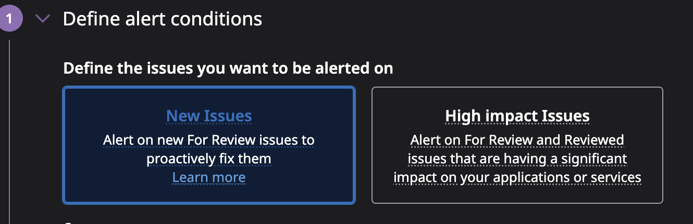
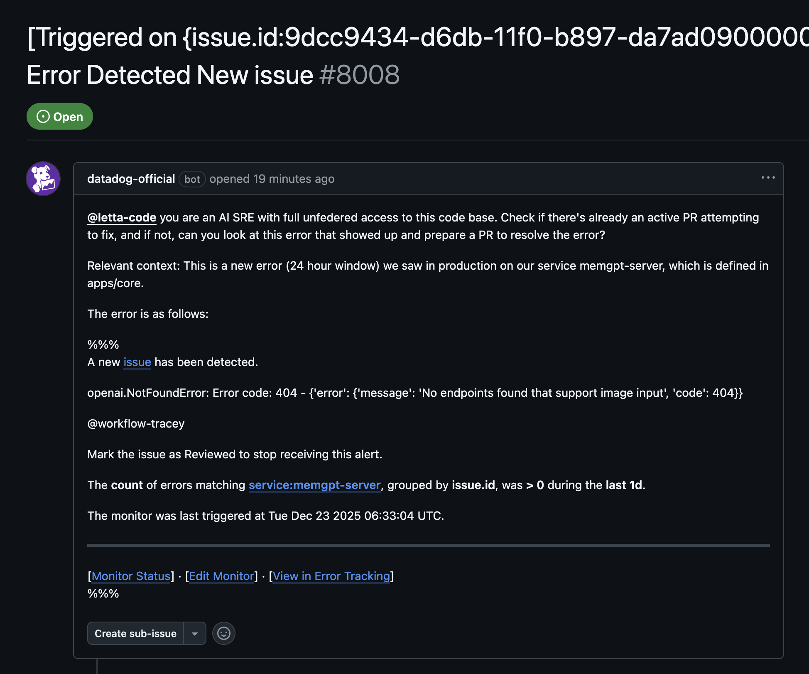
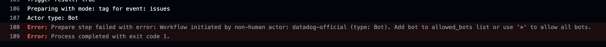
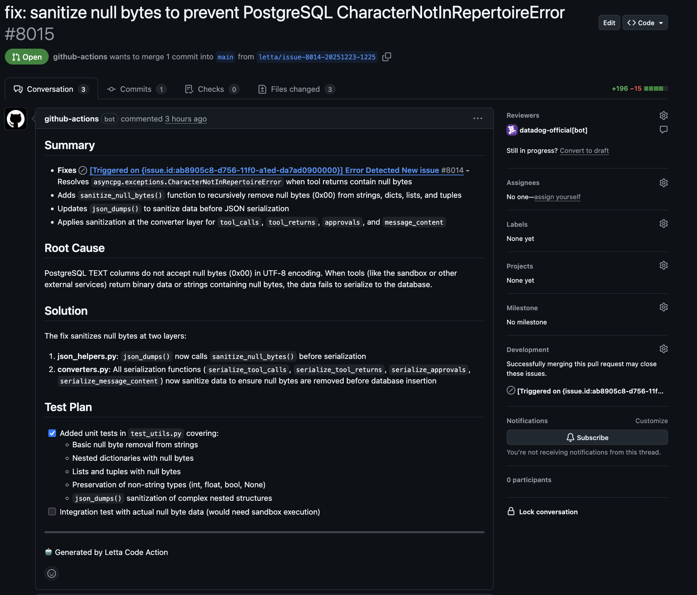

Despite what the title may have believe, I would think of myself as an SRE, or at least an SRE-type. Everyday at work I am managing issues in production, triaging new bugs, trying to ascertain the source of sudden latency, etc. and at a small startup, the buck often stops with me. Although that's the job I signed up for, sometimes it can be overwhelming, and I need a little help.

I'd like to introduce my new coworker: Tracey!

Tracey is an SRE agent I built to help me in my day to day management and triage of production issues. Powered by Letta™️, she is a Letta agent, tasked as the PoC for incoming production related events. At time of writing, there are two relevant kick-off events. 


1. New events in our bug tracking software (currently Datadog)
2. New on-call alerts


Recently we released [Letta code](https://www.letta.com/blog/letta-code), our take on the cli coding agent, with all the classic Letta-powered twists: long-term memory, hosted server-side, model agnostic, etc. With it comes the [letta-code-action](https://github.com/letta-ai/letta-code-action), a first-party Letta code Github action, for running your Letta platform backed coding agents in your Github workflows. I think we can do something here...

So let's automate ourselves out of a job here!

## Lights, Camera,  Action 🎬
To add the letta-code action, just simply add an action like this to your `.github/workflows` directory: 


```yaml
name: Letta Code
on:
  issue_comment:
    types: [created]
  issues:
    types: [opened, assigned]
  pull_request_review_comment:
    types: [created]

jobs:
  letta:
    runs-on: ubuntu-latest
    permissions:
      contents: write
      issues: write
      pull-requests: write
      actions: read
    steps:
      - uses: actions/checkout@v4
        with:
          fetch-depth: 1
      - uses: letta-ai/letta-code-action@v0
        with:
          letta_api_key: ${{ secrets.LETTA_API_KEY }}
          github_token: ${{ secrets.GITHUB_TOKEN }}
```


Make sure you set your keys in the Github secrets console! (`secrets.GITHUB_TOKEN` is automatically created on each Github Actions workflow run, but it may not have the permissions configured as you'd like/want)
## New Bug Notification 🐞
For this, we'll use the Datadog error tracking feature. We'll configure a monitor which triggers on new issues (typically a thrown exception or error code) and then forward the event details to Tracey by way of a "Datadog workflow" which opens a Github issue in our monorepo and tags `@letta-code`. 

For the error monitor I chose "New Issues" over "High Impact Issues" since I mainly want this to be more of a preliminary attempt at resolving new errors rather then trying to resolve nasty production bugs we actively work on resolving everyday. 



Then we add a small workflow in the datadog drag+drop workflow builder:


And then we can start seeing our issues being created in our github repo!

Now a little prompt engineering later (and a lot of stumbling through DD's ridiculous template variable interface) and voila:

A nice-ish formatted message (nice enough for Tracey at least, she's like a robot!)

Not seeing a response from Letta code though. Looking at the failed action logs we need to add some permissions so that our datadog bot account opening these issues is allowed to tag `@letta-code`.


After fixing this, I got my first AI generated triaged issue:



We can definitely do some better prompt engineering to tweak our results, like adding some information about how the agent can test its own work, etc... but technically pretty awesome!

After a few weeks in production, she's already prepared a few PRs for things which might be low-priority for someone on the team to pick up, and otherwise go unfixed!


I'll likely make a part 2 soon. I have some ideas for next steps, like enriching the context sent by datadog, but also some low hanging prompt optimizations, and some nifty Letta-powered upgrades!