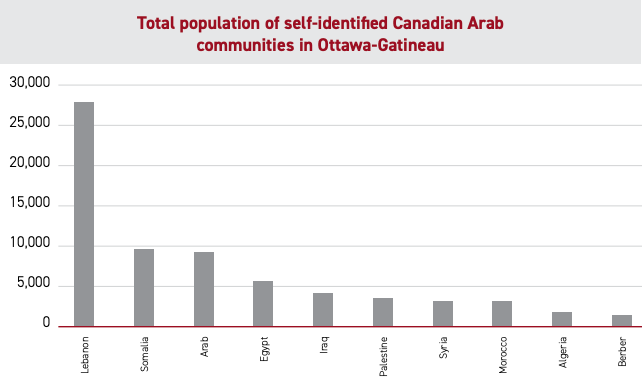
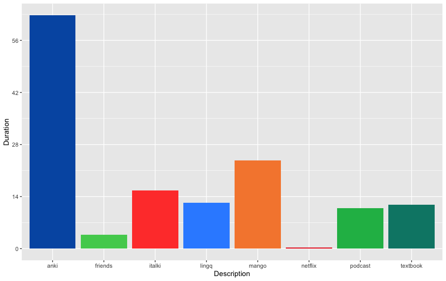

# 2021 Language Learning Review

In 2021, I was finally able to do what I had been trying to do since high school: make at least some progress in learning a foreign language.

I think what finally allowed me to do this was having my career in a good place, and being able to justify for once in my life, deprioritizing my career in favour of other interests or passions. Don't get me wrong! I am still putting in the effort to meet my self-imposed success criteria with school work, it's just that so far, that hasn't required so much time that it encroaches on my efforts in other places in my life.

## Language choice

I had previously tried and failed at learning several languages, including but not limited to Swedish, Farsi, Arabic, and Korean, but never with much success. With this new found time to commit to my pursuit of multilingualism, I reviewed the languages I was interested in learning.

To decide, I looked inside myself and examined my own motivation for learning languages. I found I cared a lot more about actually conversing with native speakers, hearing their stories, telling them mine, etc. That's why I chose Arabic! I have a storied history with Arabic speakers, including friends from high school, ex-girlfriends, and my college roommate. In fact, the city I live in has so many Arab residents, the area around my high school is literally called little Lebanon, with city-issued street signs and everything!

### Language Comparison

| Language | Pros | Cons |
|----------|------|------|
| French | Developing native level fluency in the other official language of my country. Already have some experience. | Something I can work on just by consuming more content in this language. i.e. I don't necessarily need to give this my focus to improve |
| Arabic | I have a lot of friends who speak Arabic | It's hard? |
| Korean | I already studied the basics in a course at school one semester | I had chosen Korean class because it fit best with my course time table. That alone is not sufficient motivation to learn such a difficult language |
| Farsi | Significant in my heritage and culture | I don't know that many people who speak Farsi, even as a Persian person |
| Vietnamese | I have friends who speak, love the food and culture, want to visit the country | TONES seem hard :( ... Will have to circle back |

## The Story of Arabs in Ottawa

Canada tends to have a lot of Arab immigrants based on having French as an official language, and many Arab countries having had a significant French language influence. For instance, in the case of Syria and Lebanon, the Mandate for Syria and Lebanon, established by the League of Nations.

The mass immigration of the Lebanese specifically occurred during the Lebanese civil war. Wikipedia says:

> The greatest influx of Lebanese was during the Lebanese Civil War (1975-1990), and this period saw a number of Lebanon's wealthiest and best educated move to Canada to flee the violence in their homeland. Canada and Australia were the only Western countries to set up special programs to enable Lebanese to more easily emigrate. Canada set up an office in Cyprus to process Lebanese refugees.

The Canadian Arab Institute published a fantastic report looking at the 2011 Census statistics and reporting insights regarding the Canadian-Arab community in the Ottawa-Gatineau region (among other things).

This report lists Ottawa-Gatineau as the 3rd largest population of those self-identifying as Canadian Arab, accounting for 10% of Canadian-Arabs. In fact, those self-identifying as Canadian-Arab constitute 6% of the population of Ottawa-Gatineau.

I hope it's clear that in Ottawa, Arabic would be a language in which I could often speak with native speakers. I'll remind you, this is a major point of interest and motivation for me. Thus I decided I would learn Arabic!

## Learning Arabic: Meta Learning

In Scott Young's book Ultra-learning, he describes the concept of learning about how to learn a subject as "meta-learning". Time should be spent to learn how to most effectively learn a subject. For me, this meant learning a lot of Arabic speaking countries, the Arabic that is spoken there, and the culture, as well as finding resources to learn from.

### Dialect Due Diligence

If you are unaware, Arabic is a language with many dialects. Arabs typically learn the colloquial dialect of Arabic spoken in their country at home, and then learn Modern Standard Arabic (MSA) at school. Arabs speaking different colloquial dialects may have some understanding of each other depending on the similarities of their dialects (whose even to say where you draw the line between dialects), but would typically choose to communicate in MSA. MSA is used in literature, academia, mass media, legislation, etc. so it is often perceived as less authentic and raw, and tends to sound more formal.

The general consensus is that you should learn both if you really want to be fluent and communicate effectively, since there is a need to know both to fully embrace the culture, communicate with others, and consume content from the Arab world. For example, there would be an Egyptian movie, where the dialogue is in the Egyptian dialect, but if you chose to enable subtitles, you'd find they are written in MSA!

As a language learner, you have to choose to begin studying either MSA, or a colloquial dialect (you could do it at the same time but that's a future post). Most learners typically begin with MSA, and then pick up a more localized dialect later. They often choose Egyptian because Egypt produces a lot of the media in the Arab world, in particular, movies are often in the Egyptian dialect. Most Arabs have at least some understanding of the Egyptian dialect because of its prevalence in film. Thus if you are an Arabic learner, you can probably get the best bang for your buck with Egyptian Arabic.

However, in recent years, there has been a rising popularity among Arabic learners, in starting your journey with a dialect, and then moving on to MSA, similar to how actual Arabs would learn.

When I reviewed my motivations for learning, I realized my primary goal wasn't to read Arab news, or watch Egyptian films, but to talk with people. To make real human connections with native speakers.

So which dialect would best facilitate conversations between me and native speakers? Well, take a look at the population of different Arab diaspora in Ottawa:

In case it isn't obvious, I decided to learn the **Levantine dialect**, which is spoken in Lebanon and Syria, Palestine, and Jordan.

Growing up in Ottawa, I know of so many Arabic speakers who can help me in my journey, and they are disproportionately Lebanese!

### Resource Research

When I was first beginning my Arabic studies I used the Mango Languages app, which is in my opinion the best language learning app I've used! It's a paid service that almost anyone can get access to for free through their school, local library, etc.

Mango's app utilizes colour to show word-for-word translations, and gives you lots of repetition for each phrase. It also has very high quality audio, given in different voices (helps with oral comprehension).

Once I decided to get serious and really commit, I diversified my learning resources.

Specifically I committed to introducing at least 20 new cards per day in Anki (and reviewing old cards of course). I used this Anki deck which has been pretty good in terms of its consistency (just make sure you sort the cards in the order you want to learn them, i.e. first by tag:Basic, then tag:Advanced).

I also ordered this textbook on Thriftbooks.com. Although the vocabulary is transliterated and outdated, it's been excellent for learning Grammar. It covers plenty of topics, including some really nuanced concepts like certain pronunciations, consonant clusters, etc. as well as the standard verb conjugation, pluralization, etc.

In terms of actually outputting, most of my speaking practice has been with my teacher on Italki. I think I'd like to get into writing in the next year.

Additionally, recently I have been using Lingq. It's also a paid service, but in my opinion this cost is justified since they have written content in the Levantine dialect. Essentially, it lowers the threshold for "comprehensible input" (more on that in my 2022 language goal setting post coming soon (; ) and allows you to translate words in your target language and keep track of the words you know, how often you've seen them, etc. One thing to keep in mind especially if you're learning a colloquial dialect is the lack of written content in them. I haven't used it too long, but I definitely enjoy it so far.

## Now the Good Stuff: The Data!

I tracked my progress while learning Arabic over the last few months, tracking the time I spent working on different activities. I definitely foresee a future blog post discussing time tracking, especially as it pertains to language learning, so keep an eye out for that. I also have some stats automatically collected from Anki, but that might be a follow up post.

After I got serious (final week of August) and I had been studying for a couple months, I decided to give myself a goal. I decided I wanted to reach 150 hours of study by the end of 2021. I had some progress prior to setting that goal, but it worked out to about an hour a day (128 more hours in 130 days). I ended up getting Covid during the last week of the year, so I only hit 140 hours, but still proud of this accomplishment nevertheless.

### Time spent by Activity

I tracked my time in an application called toggl, where I would log how much time I spent doing different activities. I didn't make too great an effort to track the times at which I was studying. This was a conscious choice, since even something as little as that can make me give up on something like this. I wanted to make this as easy as possible to start doing.

First, I graphed the total time I spent studying, grouped by activity, to view how much time I spent doing each activity.

In raw numbers:

| Activity | Time studied |
|----------|--------------|
| anki | 2d 14H 15M 0S |
| friends | 3H 45M 0S |
| italki | 15H 30M 0S |
| lingq | 12H 15M 0S |
| mango | 23H 30M 0S |
| netflix | 15M 0S |
| podcast | 10H 45M 0S |
| textbook | 11H 45M 0S |

### Time Spent by Core Competency Developed

If you tag the activities with which of the 4 core competencies of language learning developed while doing them, my breakdown looks something like this:

When thinking about how to divide my time between different skills, I often reference [this reddit post](https://www.reddit.com/r/languagelearning/comments/5tjjcr/i_made_a_language_study_schedule_template_what_do/), which provides suggested breakdowns depending on time available for you to study:

Based on my breakdown, I'd like to spend some more time synthesizing and expressing ideas in Arabic, whether that's writing or speaking.

I don't mind the investment in vocabulary, since that includes using Lingq, however I found online that you should aim for a retention rate of 80%-90% in Anki, and my current retention rate is 100% for Mature cards and 99% for young cards.

This isn't a bad thing, it simply means that I have some room to improve towards optimal use of my time. I'd like to either increase the number of new cards I do each day (Have to spend more time on Anki), or increase the time interval (show me card less frequently, overall study time on Anki decreases). If I choose the latter option, I can defer my freed up time to comprehension focused activities, as that's where I feel I am the most lacking.

Therefore, in 2022, I'd like to focus less on learning through Anki (Rote memorization), but to begin to lean on my comprehension skills (reading and listening) to acquire vocabulary, and practice production (oral and written) to improve my ability to synthesize speech in Arabic.

### General Trends

Tracking my time in Toggl Track, I looked at the time spent over my learning period, bucketed into weekly bins, and found what appears to be a somewhat trimodal distribution.

You can see I consistently did heavier studying when I had more free time: when school caught up to me in September, after midterms in late October, and finally after final exams in mid December (Minus a few hours in the last week of the year thanks to Covid).

I also framed this same data as progress toward my 150 hour goal:

What I find most telling is how learning rate can fluctuate a lot, but rendered negligible by your consistency over time. In this case, I was sometimes ahead of schedule, and sometimes behind, but still ended up in about the same place. This got me thinking. What were the lengths of the periods in which I was behind or ahead of schedule?

**57 days!** The longest period for which I was "behind schedule" was 57 days. This is really cool, but moreover, it should be used as a motivator. It's so easy to fall behind, or not quite hit your short-term goals. I personally struggle to work towards long-term goals without obvious short-term progress. But if I can continue for 57 days, almost 2 months, without keeping up with the pace I've set for myself, but ultimately end up in the same place, then next time I start to fall behind in my short-term goals, I won't feel nearly as disappointed, or demotivated. A true testament to the power of consistency.

## Conclusion

All in all, I'm really happy with my progress so far, and really proud for sticking to my goals for so long. Really excited for what's to come, which I will be outlining in my next post describing my 2022 language learning goals!
goals!
next post describing my 2022 language learning goals!
o come, which I will be outlining in my next post describing my 2022 language learning goals!
