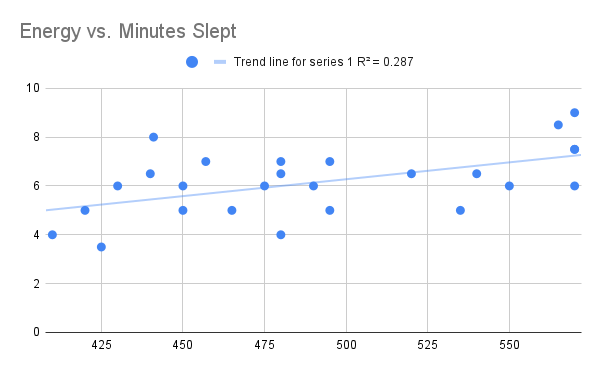
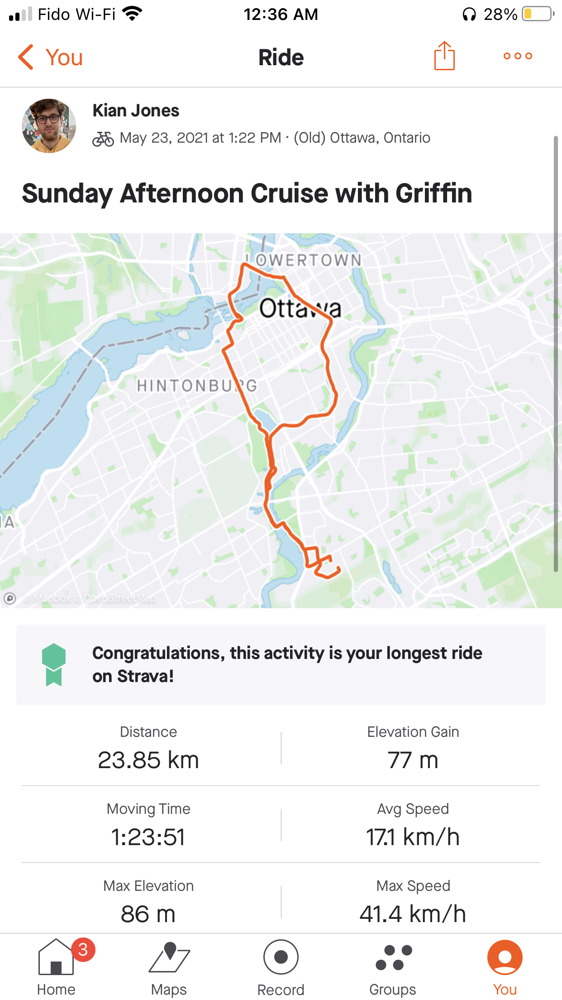
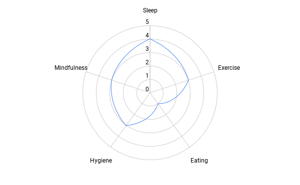

# 2021 Resolutions - End of Year Review

## Goals from 2021

Without any review, I already know one improvement to my process will be to review more frequently throughout the year to mitigate mission drift over the course of the year, and to adjust or change goal if needed.

Last year I said I wanted to be the type of person who...
- Is healthy
- Has a successful career
- Speaks foreign languages

## 2021 at a Glance

I defined my focus for 2021 to be health, since I had lined up my internship at Facebook for the coming summer, and I felt I didn't have enough time to commit to learning languages at the time.

Over the span of 2021, I slowly shifted my focus from health, to language learning. This is not inherently a bad thing, in fact I would say it has helped to form my thoughts on the identity I am forging. I believe the difference comes down to notoriety, in that I desire to be someone who is relatively good health, but not to the extent that it detracts from the other aspects of my life. Let me elaborate. Although I wish to be in good health, I don't desire to be, for example, known for being outdoorsy, or very fit. Health is important to me in the capacity of further and better enabling myself to become the person I want to be and to pursue my other interests.

Examples of what I mean:
- Exercise leading to better sleep and even general improvements to daily comportment and mood
- Less time and energy wasted, for instance, efficiently and proactively dealing with anxiety, thoughts, or emotions
- Mitigating risk of medical issues, or even extending my lifespan (maybe a bit of an extreme example (; )

To phrase it in a way which is more qualitative/quantitative: I want to participate in healthy activities to improve my life elsewhere. It is was my intention to at least begin by trying to capture some of the low hanging fruit, where I could get the highest return on investment of my time.

Examples of low hanging fruit:
- Staying hydrated
- SOME exercising (e.g. 3 times a week)
- Relatively healthy eating (e.g. cutting back on junk, eating more vegetables, more complete and consistent meals.)

Another quote from my goal setting last January: "I have identified sub-goals, which each correlate to a different aspect of what I view as a healthy lifestyle. Alongside each sub-goal, I have identified the system I will use to reach that sub-goal."

These aspects of a healthy lifestyle are as follows:
- Sleep
- Exercise
- Eating
- Hygiene
- Mindfulness

Let the review begin!

## Per-sub-goal Review

### Sleep

Sleep was something I was just starting to understand better when I set last year's goals. Officially, my sleep sub-goal was to "give myself the opportunity to sleep up to 10 hours every night."

As you'll see with my other sub-goals (or as you may know of me as a person), I tend to bite off more than I can chew. This definitely applies here. Firstly, ten hours is a lot more than you think. To give yourself the opportunity to sleep that long requires at least half a day. Secondly, it's hard to effectively measure the impact.

The single greatest insight in this aspect of my life has been **consistency**. After about a week of consistently waking at the same time, it becomes exponentially easier to have healthy sleep habits. The best example of this from the past year is a small time slice during which I was alone at home, just me and my wonderful puppy dog Talla. Talla is key to this story, since she has a pre-existing sleep pattern of rising between 7-8am and going to sleep between 10-11pm. Being forced to wake up at a consistent time, regardless of what time I went to bed, gradually put me into a position where I was consistently waking up at 8am (not tired), and becoming tired initially at 9pm. This (relatively) early fatigue, was a useful signal to me to begin winding down for bed, and encouraged going to bed early, since I actually felt tired!

In 2022, I'd like to have an alarm set to rise at a consistent time every morning, which I commit not to change, no matter what time I go to sleep. Too often did I have this intention, but with only a soft requirement, enabling me to push back my morning alarm in favour of getting a fuller sleep, at the expense of consistency. I believe I would be happier if I committed to a more structured approach. This may involve setting boundaries with myself and other around me and being disciplined about sticking to them.

Overall, I would consider this sub-goal successful since I was more cognizant of my sleep habits, learned about my body, and made an effort to get more sleep.

### Exercise

Exercise is definitely a sub-goal in which I'd like to improve. Exercise performed as part of Ultimate and as a byproduct of moving in with my mother full-time, living with a dog that needs walking, lead to me sometimes rigorous, somewhat consistent, exercise.

I did have a brief phase during the summer (when I was not working IIRC) where I was cycling or even running everyday. However little, I'm still proud since it's never been something I tried. I can definitely see why people struggle to build an exercise habit!

To improve my work done toward this sub-goal, I think a small commitment on my part to being more deliberate and intentional in getting daily exercise would go a long way.

### Eating

In January 2021, I decided I wanted to...
- Eat 3 discrete meals per day
- Eat minimal junk food
- Stay well hydrated

And in January 2022 I can safely say... I did not stick to this sub-goal at all! I did only recently improve my hydration game, mostly because I got a new water bottle (https://www.parksproject.us/products/power-to-the-parks-shrooms-insulated-water-bottle) which is insulated and bigger than my previous water bottle (32oz).

### Hygiene

Since being in lockdown because of Covid-19, my typical routine has been interrupted. The biggest repercussion of this interruption has been that my habit of brushing my teeth every morning on my way out of the house had fallen by the wayside. Embarrassingly enough, I still struggle to do this every morning but hey, sometimes is better than never!

Of notable improvement has been flossing. I have been flossing everyday for the last couple months, sometimes even multiple times per day. Very happy about this improvement, and motivated to get back into morning brushing.

### Mindfulness

Mindfulness, similarly to my exercise sub-goal, is another place I saw some improvement, but not to the level I'd like. I had set out to... journal everyday?? Definitely didn't manage that! And talk about low hanging fruit, I didn't even finish the headspace series on Netflix!

I had some wins in this category though. I had 15 therapy sessions. I even practiced a bit of yoga and meditation this year. I'd like to get back to the meditation and yoga more in this next year, even if only part of falling asleep and as port of a workout respectively.

https://youtu.be/ZP34IA0d8LI

Watched this video like 100 times. Funny enough she’s actually a yogi in Ottawa!

Overall, I think I've developed a better ability to recognize behaviour and thought patterns I'd like to change, and I hope to build on that in the new year by making the effort to change my default when I notice that pattern.

## Summary

2021 was an awesome year, and I believe reviewing my goals and progress towards them more frequently throughout the year would lead to less mission drift, and in turn, a higher rate of success in achieving my goals.

Stay tuned for a follow up post reviewing my language learning process in 2021, and 2022 resolutions part 2 which will discuss my goals for 2022.