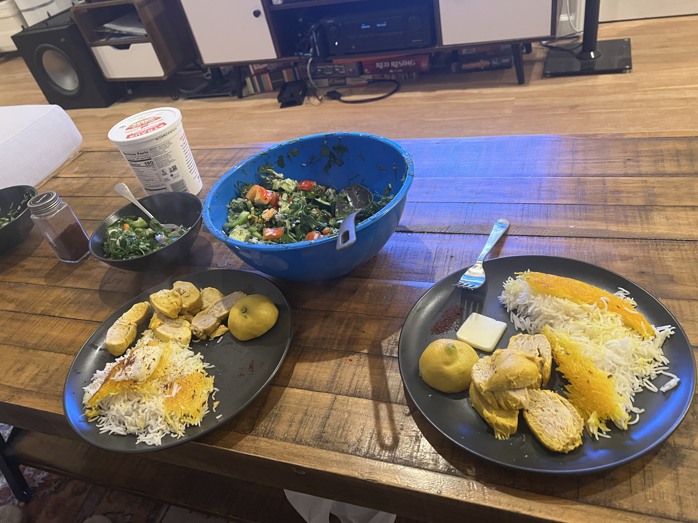
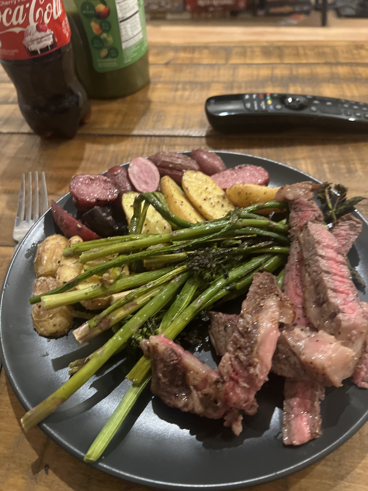
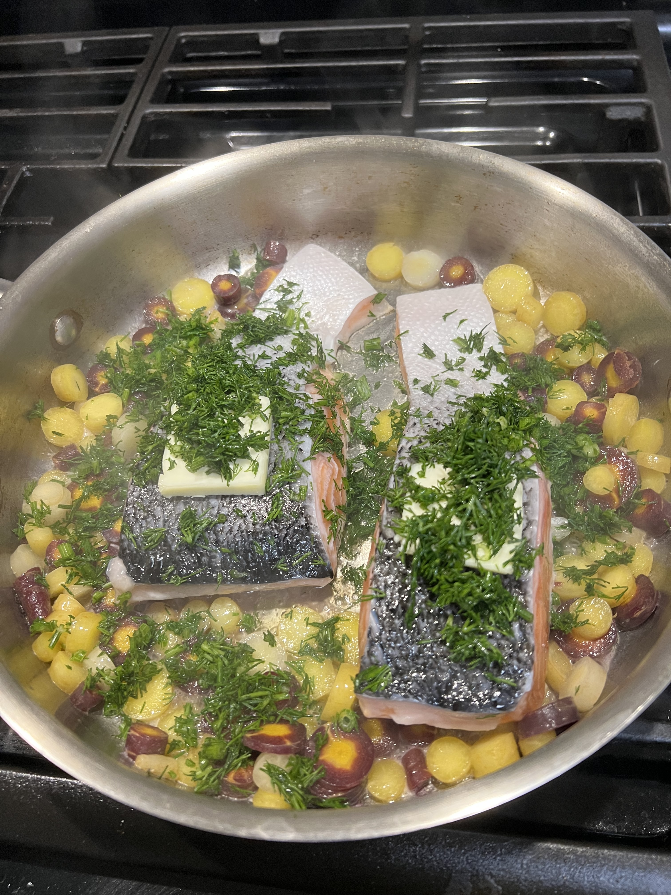
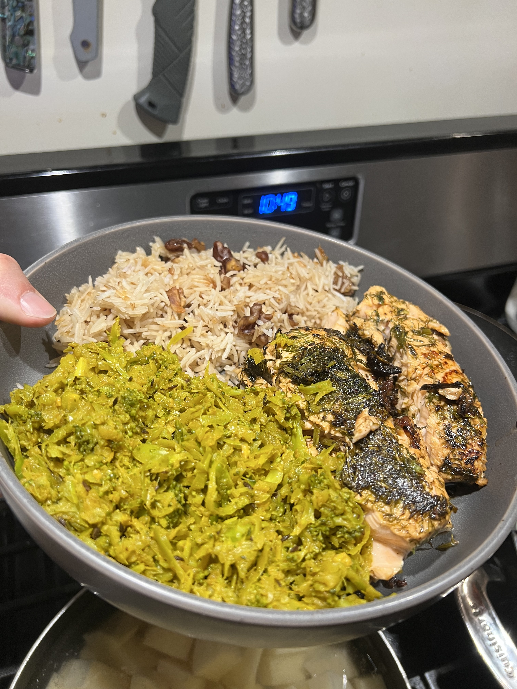

# The Joy of Cooking
I had an epiphany recently. It's really easy in the tech industry to eat all your meals at work, or at least some, to the point you just eat out otherwise. No point in buying groceries if you're gonna have to throw out half of them because you only eat 2 meals a week at home. In fact, even just the dialogue of SF tech worker is to be blamed, pragmatic and logical to a fault. We start to justify and calculate the expected cost of eating out vs cooking at home, chasing optimization, searching for global minima

## Stop Preempting The Joy of Cooking
Let it happen. The need to compute the calorie to cost efficiency of our daily meals and culinary lifestyle is too far. For me, I realized one of the things I enjoy most about spending time with my family is some of the delicious home cooked meals my loved ones make. Even my girlfriend is an excellent cook and I relish the opportunity to eat her creations. But how can I ever expect to reciprocate for her, or to give my child the same experience that I so richly appreciate, if I'm not doing my due diligence now to skill up in cooking. The only reason anyone is a good cook is because they've done it a lot.

## It's Not Just the Long-Term
Although my motivation to start cooking more was ambitious and long-horizon, I think there's immediate value in cooking at home. There's something meditative about it. You are so focused on your hands and what you're doing with them. It's stimulating. It's active. Enough that you can't do anything else... but not too much that you can't get lost in thought :)

## Pitch (Im-)perfect
There's just something about the imperfection of cooking. Its tolerance for different ingredients and quantities. Its forgiveness in seasoning and cook time. 

When I first learned to drive, I was struck by how easy it was to do things incorrectly. I remember thinking things weren't nearly as black and white as I had expected. Cooking is a lot like driving. There are ways to do it wrong, but there's plenty of people who drive differently but sufficiently well/safely.

## Case Studies

Persian Food

Steak

Fish from farmer's market

Broccoli Thoran
